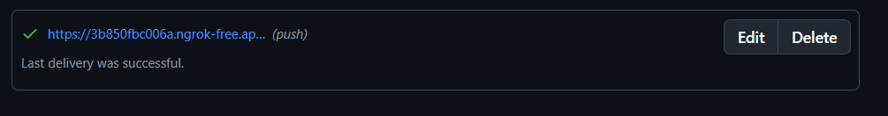
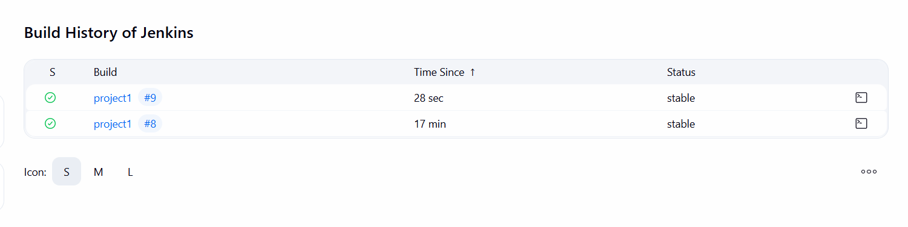

# POV-JAVA Jenkins Project

## Overview

This project demonstrates a Java application with Docker containerization and Jenkins CI/CD pipeline.

## Screenshots

### Image 1


### Image 2


## Docker

This project includes a Dockerfile for containerization:

```dockerfile
FROM eclipse-temurin:17-jre
WORKDIR /App
COPY target/*.jar app.jar
EXPOSE 8282
ENTRYPOINT ["java","-jar","app.jar"]
```

## Getting Started

### Prerequisites
- Java 17
- Maven
- Docker

### Build and Run

1. Build the project:
   ```bash
   ./mvnw clean package
   ```

2. Build Docker image:
   ```bash
   docker build -t pov-java ./POV-JAVA
   ```

3. Run the container:
   ```bash
   docker run -p 8282:8282 pov-java
   ```

## License

This project is for educational purposes.
